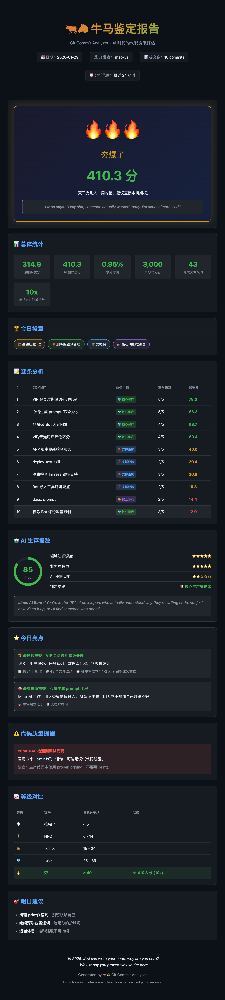

# Git Commit Analyzer - 牛马鉴定器 🐂🐴

用 AI 分析 git 提交，鉴定你今天是「夯」还是「拉完了」。

**2026 AI 时代版**：代码量不代表贡献，脑子才是。新增 **重写指数** 和 **业务价值** 评估维度。

> *"In 2026, if AI can write your code, why are you here?"* — Linus

## 核心理念

传统指标（行数、提交数）在 Vibe Coding 时代已经过时。本工具回答真正的问题：

- **这代码值多少斤？** → 重写指数（AI 能否快速重写）
- **这代码解决了什么问题？** → 业务价值（核心资产还是存在即浪费）
- **这个人在 AI 时代能活吗？** → AI 生存指数

## 评级体系

| 等级 | 称号 | 颁奖词 | Linus 说 |
|------|------|--------|----------|
| 🔥 夯 | 代码之神 | 建议申请调薪 | "Not bad." |
| 💎 顶级 | 团队支柱 | 老板看了直呼内行 | "Acceptable." |
| 👑 人上人 | 稳定输出 | 职场中坚力量 | "It works, I guess." |
| 🧍 NPC | 打工人 | 今天也是普通的一天 | "Do you even know what you're doing?" |
| 💀 拉完了 | 带薪摸鱼 | 明天记得努力 | "What the fuck is this shit?" |

## AI 时代新维度

| 维度 | 问题 | 影响 |
|------|------|------|
| 🤖 重写指数 | AI 重写需要多久？ | 1/5 = ×0.5，5/5 = ×1.3 |
| 💎 业务价值 | 这代码解决了什么问题？ | 核心资产 ×1.5，存在即浪费 ×0.2 |
| 🛡️ AI 生存指数 | 这个人能被 AI 替代吗？ | 0-100，< 40 建议转型 |

## 安装

```bash
npx skills add shaoxyz/git-commit-analyzer
```

## 依赖

| 依赖 | 用途 | 必须 |
|------|------|------|
| Python 3.8+ | 运行分析脚本 | ✅ |
| Git | 获取提交记录 | ✅ |
| ast-grep | 多语言代码分析 | 可选 |

> 💡 不装也行，反正在 [Claude Code](https://docs.anthropic.com/en/docs/claude-code) / [opencode](https://github.com/opencode-ai/opencode) 等工具中执行时，缺失依赖会自动修复，模型会自己想办法。

## Quick Start

```bash
# 在 Claude Code / opencode 中直接调用
/git-commit-analyzer

# 或带参数
/git-commit-analyzer --repo /path/to/repo --since "1 day ago"
```

AI 会自动完成：获取提交 → 代码分析 → 生成报告 → 输出牛马鉴定结果。

## 示例报告



<details>
<summary>查看完整 HTML 报告</summary>

下载 [examples/git-commit-report-2026-01-29.html](./examples/git-commit-report-2026-01-29.html) 后用浏览器打开。
</details>

## 文档

[完整文档 & 评分算法](./skills/git-commit-analyzer/SKILL.md)

## 重要声明 ⚠️

**测不出来的**：
- 花一天 debug 最后只改一行的痛
- code review、带新人的隐形付出
- 读懂祖传代码所消耗的脑细胞
- 那些"为什么这样写"只有原作者知道

**当成团队娱乐工具，严禁用于绩效评估。**

在 AI 时代，80%+ 的代码可以被快速生成。但那 20% 的领域知识、架构决策、业务理解 —— 这才是人的价值。

## License

[MIT](./LICENSE)
