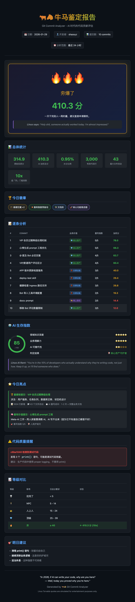

# Git Commit Analyzer · 牛马鉴定器 🐂🐴

用确定性指标和 AI 上下文分析 Git 提交：证据认真，表达有趣。

它不按行数论英雄，而是区分机械改动、有效实现、测试与文档、领域知识、诊断难度和真实影响。最终可以输出简洁复盘，也可以生成一份有称号、有徽章、有吐槽的“牛马鉴定报告”。

## 特点

- **Harness 无关**：适用于能够读取 skill、运行 Python 与 Git 的编码代理，不绑定 Claude Code、Codex、opencode 或特定工具名。
- **本地优先**：直接分析本地 Git 仓库，也支持 GitHub 和 GitLab。
- **证据分层**：区分机器指标、启发式信号与上下文判断，并标注置信度。
- **趣味但不伤人**：吐槽代码和提交模式，不评价人的智力、职业价值或绩效。
- **双语报告**：支持中文和英文 Markdown / HTML 输出。

## 安装

```bash
npx skills add shaoxyz/git-commit-analyzer
```

运行环境需要 Python 3.10+ 和 Git。`ast-grep` 仅用于可选的多语言 AST 信号：

```bash
npm i -g @ast-grep/cli
```

## 使用

安装后，在支持 skills 的编码代理中直接提出任务，例如：

```text
分析当前仓库过去一天的提交，生成一份牛马鉴定报告。
Review last week's commits and give me a concise, neutral engineering summary.
比较 Alice 和 Bob 本月的提交模式，但不要把代码量当作贡献。
```

代理会完成：获取提交 → 计算客观指标 → 补充必要上下文 → 生成分析 → 渲染报告。

脚本也可以独立运行。将 `SKILL_ROOT` 替换为本仓库的 `skills/git-commit-analyzer` 目录：

```bash
python3 "$SKILL_ROOT/scripts/fetch_commits.py" /path/to/repo --since "1 day ago" -o commits.json
python3 "$SKILL_ROOT/scripts/analyze_code.py" commits.json
python3 "$SKILL_ROOT/scripts/generate_prompt.py" commits.json --lang zh -o prompt.md
python3 "$SKILL_ROOT/scripts/generate_report.py" analysis.json --lang zh --format html
```

## 示例报告

<a href="./examples/report-preview.png"></a>

[查看完整 HTML 示例](./examples/git-commit-report-2026-01-29.html)

## 边界

Diff 看不到调研、失败方案、Code Review、事故压力和许多业务背景。所有分数都应当用于代码复盘和团队娱乐，**不得用于绩效评估或雇佣决策**。

完整工作流与评分边界见 [`SKILL.md`](./skills/git-commit-analyzer/SKILL.md)。

## License

[MIT](./LICENSE)
